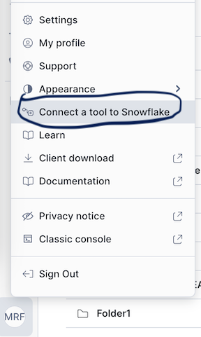

# PreConfigured Spark Environment

This repository leverages devcontainers to provide a quick environment with Spark already setup and some useful extensions

# How to get started.

1. Fork this repository

After your for the repository it might look like this:

2. Click on the Open in CloudSpaces

Look for the CloudSpace button an create a new cloud space

After your start your cloudspace you will need to wait some time. 
You might see some messages like:

Give it 3-5 minutes for your cloudspace to be ready.

3. Go to the Snowflake Extension to navigate to the config file (~/.snowflake/connections.toml)

By default a template is populated:

You need to adjust this file. Retrieve your connection settings from your account. In snowsight you can use the connect tool option

You can copy the settings from the config file option:

4. Once your connection is set you should be good to start testing.

Go to `pyspark-test.py` and run it.

> NOTE: when working with SSO or other external browser authentation, you will see a link displayed in the output. You can click on that link and it will be opened on another tab. That is the link used for authentation. After you link it the address will change to something like https://locahost:5050?token=.... copy that URL, open a terminal and run `wget <copied url>` and enter, this should complete the handshake and establish the connection.